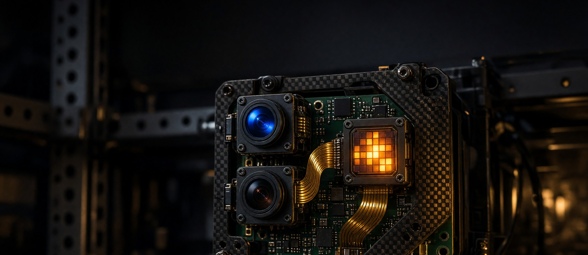

<div align="center">



<h1>SensorHead-RS</h1>

<p><strong>Physical senses for an ApexOS Pi, in Rust as far as the hardware allows.</strong><br>
The SensorHead option (thermal, air, cameras) rewritten as a standalone sibling.<br>
Vendor C/C++ and Python stay only behind the two named walls.</p>

<p>


</p>

</div>

---

> [!NOTE]
> Bosch **BSEC2** (BME688 IAQ) and Raspberry Pi **libcamera / Picamera2** (IMX500 / IMX708)
> are the pieces that cannot be honest pure Rust. Everything else — HTTP, MCP, thermal I2C,
> raw BME688 T/RH/P/gas, ironbow, sentinel policy — is in scope to port.

## What it is

SensorHead is the optional sense array on an ApexOS Pi 5 node (apex1 has one attached):
Sony IMX500 AI camera, IMX708 Wide NoIR, MLX90640 32×24 thermal, BME688 environmental.
The original (`buckster123/SensorHead`) is Python. This repo is the Rust rewrite: keep the
`:8080` contract ApexOS-RS already polls, own the orchestration in Rust, and **link** the
vendor libraries only where their licenses or SDKs force it.

## Install

```sh
git clone https://github.com/buckster123/SensorHead-RS
cd SensorHead-RS
git clone https://github.com/buckster123/SensorHead.git py-source   # read-only source ref
cargo build --release --workspace
```

## Use

The live head on apex1 is still the Python dashboard on `:8080`. This binary is the
drop-in face — it proxies the vendor walls and renders the thermal heatmap itself:

```sh
cargo run -p sensorhead-api -- --bind 127.0.0.1:18080 --upstream http://192.168.0.158:8080
curl -s http://127.0.0.1:18080/health
curl -s http://127.0.0.1:18080/api/environment
```

On a sensor node, stop the Python unit and bind `0.0.0.0:8080` with
`SENSORHEAD_UPSTREAM` pointed at the Python process on a side port. Do not steal
`:8080` from a running dashboard by accident — the default bind is loopback.

## How it works

```
ApexOS-RS  apex-sensor-bridge / gateway
        │  SENSORHEAD_URL=http://127.0.0.1:8080
        ▼
  SensorHead HTTP  (:8080)     ← Rust target; same JSON as py-source
        │
   ┌────┼────────────────┐
   ▼    ▼                ▼
IMX500  MLX90640      BME688
libcamera  I2C 0x33   I2C 0x77
Picamera2             BSEC2 (C) or raw fallback
```

Portability map and the checkout recipe: [`docs/upstream.md`](docs/upstream.md).
Wire contract: [`docs/design.md`](docs/design.md).

## Docs

| File | What's in it |
|------|--------------|
| [`docs/design.md`](docs/design.md) | The contract — wire format, API, invariants |
| [`docs/upstream.md`](docs/upstream.md) | `py-source/` + BSEC2 / libcamera walls |
| [`docs/CHARTER.md`](docs/CHARTER.md) | Binding decisions |
| [`BACKLOG.md`](BACKLOG.md) | Slice ledger — what's shipped, what's next |

## License

MIT — see [LICENSE](LICENSE). The Bosch BSEC2 binary is **not** MIT and is never vendored
here; operators obtain it under Bosch's own terms.

<sub>Banner generated with <a href="https://github.com/buckster123/Imaginarium-RS">Imaginarium-RS</a> (job <code>01M0AFFSXHHS71FTTG4ZAJJC3B</code>).</sub>
